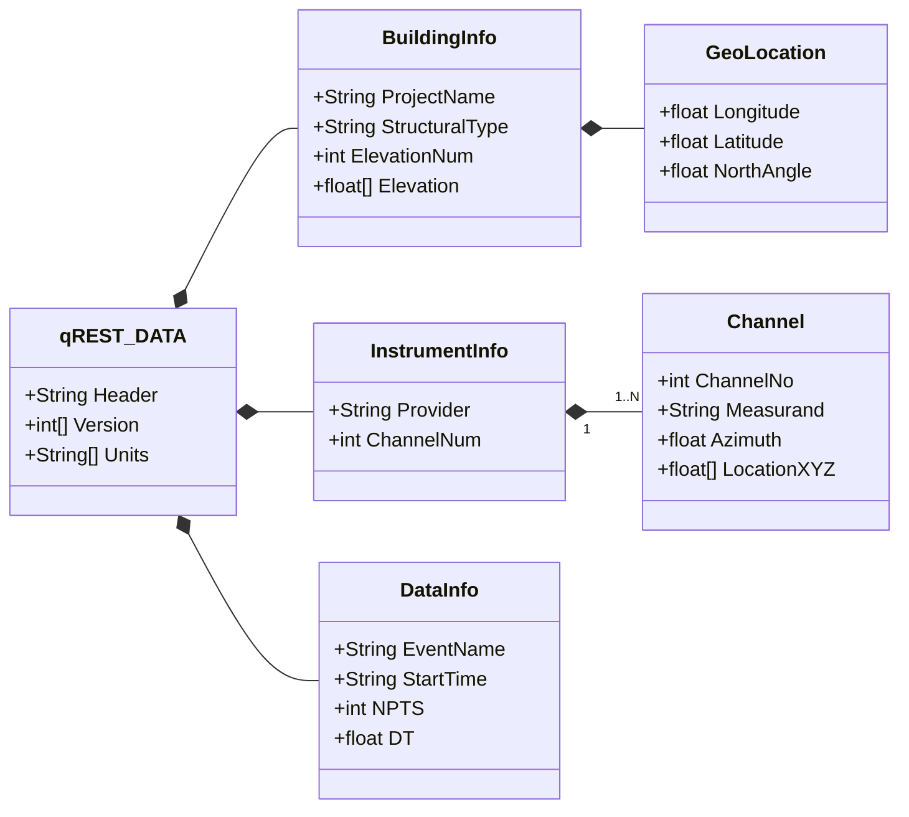

一些其他的图

JSON配置的类图

```mermaid
classDiagram
    direction LR
    class qREST_DATA {
        +String Header
        +int[] Version
        +String[] Units
    }

    class BuildingInfo {
        +String ProjectName
        +String StructuralType
        +int ElevationNum
        +float[] Elevation
    }

    class GeoLocation {
        +float Longitude
        +float Latitude
        +float NorthAngle
    }

    class InstrumentInfo {
        +String Provider
        +int ChannelNum
    }

    class Channel {
        +int ChannelNo
        +String Measurand
        +float Azimuth
        +float[] LocationXYZ
    }

    class DataInfo {
        +String EventName
        +String StartTime
        +int NPTS
        +float DT
    }

    qREST_DATA *-- BuildingInfo
    qREST_DATA *-- InstrumentInfo
    qREST_DATA *-- DataInfo
    BuildingInfo *-- GeoLocation
    InstrumentInfo "1" *-- "1..N" Channel
```