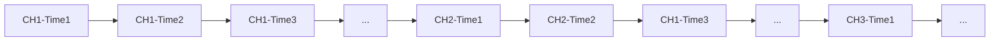

# 结构监测时序数据格式方案：基于 miniSEED 3 规范

## 1. 规范概述

本监测系统的数据组织与存储格式采用国际数字地震台网联合会（FDSN）发布的 miniSEED 3 (mSEED3) 标准。该标准是一种专为地球物理观测与土木工程结构健康监测（SHM）设计的二进制时序数据序列化协议。

## 2. 数据结构与组织范式

miniSEED 3 摒弃了传统的“全局文件头+二维数据矩阵”设计，采用**无状态流式区块（Stateless Streaming Chunks）**架构。每个区块包含一个独立的头部和数据段，头部记录了该区块的时间戳、采样率、通道标识、数据类型等元信息，而数据段则存储实际的时序数据点。区块之间通过链式结构连接，支持动态添加、删除和重组，极大提升了数据的灵活性和可扩展性。

### 2.1 宏观组织

基于独立记录的流式拼接在 miniSEED 3 的逻辑中，不存在“文件（File）”的全局约束，数据的基本封装单元是数据记录（Data Record）。

- 数据流组合：一个完整的数据流（或文件）由任意数量的独立 Data Record 首尾相接构成。
- 多通道复用：不同物理通道的数据不允许在同一个 Record 的数据荷载中交织编码。多通道数据的同步依赖于 Record 级别的拼接排列（如时间交织排布或通道主序排布），由解析库在读取时基于每个 Record 的独立时间戳动态重构多通道平行时间轴。

### 2.2 微观解剖

Data Record 内部结构每个变长的 Data Record 逻辑上由四个顺序排列的区块组成，确保了单个区块的自描述性：

- 固定头 (Fixed Header, 40 Bytes)：包含解析该段记录所需的最底层二进制参数：
  - 格式标识：ASCII 字符 MS 及版本号 3。
  - 时间基准：起始时间戳，支持纳秒（ns）级精度（遵循 ISO 8601 逻辑）。
  - 采样属性：以双精度浮点数表示的采样率（SPS），及该记录包含的数据点总数（NPTS）。
  - 记录长度：当前完整 Record 的总字节数。
  - 编码标识：数据荷载所使用的压缩或编码格式代码。
  - 校验码：基于整个记录体（包括元数据与波形）计算的 CRC-32 校验和。
- 源标识符 (Source Identifier)：变长 ASCII 字符串，采用 FDSN 统一资源名称（URN）规范（如 FDSN:XX_Project_Channel_Axis），用于唯一确定当前 Record 的物理数据源。
- 附加元数据 (Extra Headers)：变长区块，采用标准 JSON 格式编码。该结构允许以匿名根对象的形式嵌入自定义嵌套数据字典（如本方案定义的 qREST_DATA 结构体），用于存贮结构物理坐标、传感器标定系数、通道映射等非稳态信息。
- 数据负载 (Data Payload)：变长区块，存储连续的单通道物理波形数据。数据可依据固定头中的编码标识，采用 IEEE 754 浮点数（32-bit/64-bit）或高压缩比的整数差分算法进行序列化。

### 2.3 例子分析

具体案例：3个通道，200Hz，100秒，每个通道20000个点。

如果以时间切块，设定每个 Record 包含一个通道中 1 秒的数据，则每个 Record 的数据负载为 200 个点。一共60000个数据点，需要300个 Record 来存储完整数据流。其组织可以是：

其内容表示：
> 【第 0~1 秒的数据】
> [Record 1] 通道 1：第 0.000s - 0.995s 的 200 个点
> [Record 2] 通道 2：第 0.000s - 0.995s 的 200 个点
> [Record 3] 通道 3：第 0.000s - 0.995s 的 200 个点
> 【第 1~2 秒的数据】
> [Record 4] 通道 1：第 1.000s - 1.995s 的 200 个点
> [Record 5] 通道 2：第 1.000s - 1.995s 的 200 个点
> [Record 6] 通道 3：第 1.000s - 1.995s 的 200 个点
> ...

也可以是：

其内容表示：
> 【通道 1 的完整数据】
> [Record 1] 通道 1：第 0.000s - 0.995s 的 200 个点
> [Record 2] 通道 1：第 1.000s - 1.995s 的 200 个点
> [Record 3] 通道 1：第 2.000s - 2.995s 的 200 个点
> ...
> 【通道 2 的完整数据】
> [Record 301] 通道 2：第 0.000s - 0.995s 的 200 个点
> [Record 302] 通道 2：第 1.000s - 1.995s 的 200 个点
> [Record 303] 通道 2：第 2.000s - 2.995s 的 200 个点
> ...

每个数据块的数据负载长度可变，不同数据块也可以以任意方式交织排列，解析器通过每个 Record 的独立时间戳与通道标识动态重构多通道时间轴。

## 3. 实施建议

### 3.1 文件存储

在离线归档场景中，建议将每个监测项目的完整数据流存储为单一的 miniSEED 3 文件（或对象存储中的单一对象）。该文件由多个独立的 Data Record 首尾相接构成，记录了所有通道的完整时序数据与元信息。其中每个 Record 存储一个通道的完整数据，Record 之间通过时间戳和通道标识进行逻辑关联。
这样一个18通道的监测项目一次事件的完整数据就包含18个独立的 Record，每个 Record 包含一个通道的完整数据流。他们都拥有完整的固定头、源标识符、附加元数据和数据负载，且通过时间戳和通道标识进行逻辑关联。

### 3.2 实时传输

在边缘设备实时传输场景中，建议将每个通道的短时数据（如 1 秒）封装为一个独立的 miniSEED 3 Record 进行发送。接收端通过解析每个 Record 的时间戳和通道标识动态重构多通道时间轴，实现低延迟的数据流处理与分析。

## 4. 问题和分析

1. 每个数据块(Record)的是否应当包含完整的Extra Headers？

我觉得对于文件存储场景，由于Record数量较少，每个Record都包含完整的Extra Headers可以提高数据的自描述性和独立性；但对于实时传输场景，频繁发送完整的Extra Headers可能增加网络负担，是否可以考虑在实时传输中只在第一个Record发送必要的元信息，后续Record仅发送数据负载，接收端通过第一个Record的元信息进行解析？这样可以在保证数据完整性的同时减少网络负担。

以云南省院为例，其Extra Headers约6kb，如果1s发送一次共18个Record，每个Record的除去Extra Headers的部分约为:
40B（固定头）+20B（源标识符）+200*4B（数据负载）=840B
如果每个Record都包含完整的Extra Headers，则每个Record的大小约为6kb+840B=6.84kb，其中有效数据占比仅为840B/6.84kb≈12.3%。

2. 浮点数编码

miniSEED 3 标准支持多种数据编码格式，包括浮点数（32-bit/64-bit）和高压缩比的整数差分算法。各种浮点数编码方式都可以使用，并且理论上miniSEED 3的解析库应该能够正确解析这些编码格式。不过我了解到现在主流的地震行业数采设备采集器是24位的，其数据管理也以32位浮点数为主流。