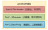
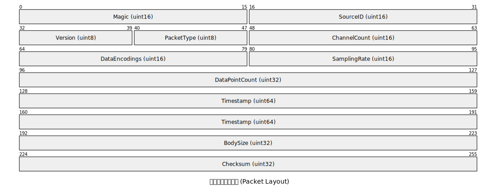
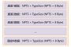

# qREST文件存储格式规范

**文档版本**: v1.0.0
**最后更新**: 2026-04-11

## 0.概述

qREST文件存储格式规范是一种专门为建筑结构轻量化地震监测（Light-weight S<sup>2</sup>HM）设计的数据格式规范，旨在提供一个统一、标准化的框架来存储和交换监测数据。该数据格式包含三个主要部分：**文件头**（File Header）、**元数据**（Metadata）和**数据包**（Data Packet）。

文件头部分采用固定长度的二进制格式，包含了文件标识、元数据长度和数据包长度等关键信息，用于快速识别文件格式和定位数据内容。

元数据部分基于JSON格式，采用模块化的设计，除了数据说明、版本号和单位约定外，包含三大核心模块：建筑信息、监测设备信息和数据包信息。得益于JSON的灵活性，元数据允许用户根据实际需求进行扩展和定制，只要本项目中定义的核心字段保持不变，用户可以在元数据中添加任意数量的自定义字段，以满足特定项目的需求。

数据包部分使用二进制编码，以高效存储监测数据。为了保证数据的正确解析和使用，数据包分为包头和包体两部分。包头包含了当前数据包中时序数据的采集时间和采样参数。包体则包含了每个通道的时序数据，按照预定义的顺序进行存储。

三部分的结构如下图所示：



## 1.基本约定

### 1.1 名词解释

- **文件头** (File Header)：位于文件的开头部分，用于快速识别文件格式和定位数据内容。
- **元数据** (Metadata)：以JSON格式存储的基本信息，描述了本文件中的建筑信息、监测设备信息和数据包信息。
- **数据包** (Data Packet)：以二进制格式存储的监测数据，包含包头和包体两部分。
- **包头** (Packet Header)：数据包的前 32 字节，包含了当前数据包的采集时间和采样参数等关键信息。
- **包体** (Packet Body)：紧随包头之后的数据部分，包含了每个通道的时序数据，按照预定义的顺序进行存储。
- **时序数据** (Time-series Data)：每个通道的监测数据，按照时间顺序排列，包含了每个采样点的数值。
- **通道** (Channel)：监测系统中的一个独立测量通道，通常对应一个单向传感器或一个测量点的单向测量通道。
- **采样点** (Data Point)：时序数据中的一个单独数据值，代表了某个特定时间点的测量结果。
- **采样率** (Sampling Rate)：每秒钟采集的数据点数量，通常以赫兹（Hz）为单位表示。

### 1.2 局部坐标系约定

在解析本数据文件时，需严格遵循以下局部坐标系约定：

- 地理正北角 (North Angle)：
  定义为结构局部坐标系的 Y 轴正方向与地理正北方向之间的夹角，单位为度（°）。例如：如果 Y 轴正向与地理正北方向重合，则 North Angle 为 0°；如果 Y 轴正向指向东，则 North Angle 为 270°。
- 结构局部坐标系 (Local Coordinate System)：
  - 原点 (Origin)：以建筑底平面（正负零标高处）的几何中心为三维坐标系的原点`[0.0, 0.0, 0.0]`。
  - 轴向 (Axes)：遵循右手笛卡尔坐标系。通常 X 轴与建筑主轴线（通常为长边方向）平行，Y 轴与次轴线（通常为短边方向）平行，Z 轴垂直向上。
- 方向角 (Azimuth)：
  采用极坐标角度定义：以结构局部坐标系的 Y 轴正方向为 0°，在 XY 平面内顺时针旋转至 360°。例如：Y 轴正向为 0°，X 轴负向为 270°。

## 2.文件头详细说明

文件头固定为 **16字节**，采用 **小端序** (Little Endian) 编码，用于文件识别与快速定位。

| 偏移 | 字段名称 | 数据类型 | 长度 | 描述 |
| ---- | -------- | -------- | ---- | ---- |
| 0 | Magic| `uint64` | 8字节 | 文件标识，固定为`0x7152455354000000`("qREST") |
| 8 | MetadataSize | `uint32` | 4字节 | 元数据部分长度（字节） |
| 12 | DataSize | `uint32` | 4字节 | 数据包部分长度（字节） 

**结构体定义 (C 语言风格)**:

```c
typedef struct {
    uint64_t magic;           // 0x7152455354000000 ("qREST")
    uint32_t metadata_size;   // 元数据长度
    uint32_t data_size;       // 数据包长度
} QRestFileHeader;
```

**文件头校验流程**:

1. 读取文件前 8 字节，检测 Magic 是否为`0x7152455354000000`("qREST")；
2. 读取 MetadataSize，定位元数据部分；
3. 读取 DataSize，定位数据包部分。

## 3.元数据字段详细说明

元数据（Metadata）用于描述监测数据，包含建筑信息、监测设备信息和数据包信息。元数据是正确使用监测数据和确保其可追溯性、可比性和可重用性的基础。

**编码格式**：
- **字符编码**: UTF-8
- **格式**: JSON，以二进制方式存储（无BOM，无末尾空字符）

元数据字段的整体结构如下图所示。



### 3.1 根节点 (Root Nodes)

| 字段名称 | 数据类型 | 示例值 | 描述 |
| -------- | -------- | ------ | ---- |
|Header|`String`|元数据信息标识符，用于程序快速识别文件格式。|`"qREST_DATA"`|
|Version|`Array(Int)`|文件格式版本号，采用`[主版本,次版本,修订号]`的形式。|`[1, 0, 0]`|
|Units|`Array(String)`|数据中使用的基本物理量（距离和时间）的单位。|`["m", "s"]`|
|BuildingInfo|`Object`|监测对象（建筑结构）的位置和几何参数。|见下文[3.2](#32-建筑信息-buildinginfo)|
|InstrumentInfo|`Object`|传感器位置与配置参数。|见下文[3.3](#33-监测设备信息-instrumentinfo)|
|DataInfo|`Object`|数据包属性。|见下文[3.4](#34-数据包信息-datainfo)|

- **备注**：

Units 字段定义了数据中使用的基本物理单位，通常包括距离单位（如米 `"m"`）和时间单位（如秒 `"s"`）。一方面单位规定了元数据文件中相关物理量的单位：所有与距离相关的字段（如结构轮廓参数、传感器位置等）都应使用 Units 中定义的距离单位进行描述；所有与时间相关的字段（如采样间隔）都应使用 Units 中定义的时间单位进行描述。另一方面，单位也约束了由本数据导出的时序数据的物理单位：数据包中的包体数据必须经过适当的缩放（如乘以 InstrumentInfo 中定义的 Scale）以确保最终的数值符合 Units 中规定的物理单位。

### 3.2 建筑信息 (BuildingInfo)

建筑信息包含了监测项目的基本描述、地理位置信息、结构类型、结构轮廓以及各楼层的标高信息。该部分和监测系统无关，在建筑施工完成后基本保持不变。

| 字段名称 | 数据类型 | 描述 | 示例值 |
| -------- | -------- | ---- | ------ |
|ProjectName|`String`|监测项目或建筑物的唯一标识名/编号。|`"Kunming_SSJY"`|
|GeoLocation|`Object`|建筑物的绝对地理位置信息。|见下文[3.2.1](#321-地理信息)|
|StructuralType|`String`|结构类型描述（如 SteelFrame，RCFrame，ShearWall，Masonry 等）。|`"SteelFrame"`|
|StructuralFootprint|`Object`|建筑物底平面的二维几何轮廓描述。|见下文[3.2.2](#322-结构轮廓)|
|ElevationNum|`Integer`|结构在垂直方向上被划分的标高层数（包括地下室、地坪、各楼层和屋顶）。|`16`|
|Elevation|`Array(Float)`|各楼层的绝对标高数组，负值代表地下层。长度和ElevationNum一致。|`[-2.7, 0.0, ...]`|

#### 3.2.1 地理信息

| 字段名称 | 数据类型 | 描述 | 示例值 |
| -------- | -------- | ---- | ------ |
|Longitude|`Float`|建筑物所在位置的经度坐标。|`25.04`|
|Latitude|`Float`|建筑物所在位置的纬度坐标。|`102.70`|
|NorthAngle|`Float`|建筑物 Y 轴正向与地理正北方向的夹角，单位为度（°）。|`0.0`|

#### 3.2.2 结构轮廓

| 字段名称 | 数据类型 | 描述 | 示例值 |
| -------- | -------- | ---- | ------ |
|Shape|`String`|截面形状。支持`Rectangular`(矩形)、`Circular`(圆形)、`Polygon`(多边形)等。|`"Rectangular"`|
|Parameters|`Object`|形状参数：根据不同形状提供相应的参数，见备注|`{"Length": 41.2, "Width": 25.2}`|
|BoundingBox|`Object`|外接包围盒坐标。以几何中心为原点，标定结构在 XY 平面内的最大边界。|`{"MaxX": 20.6, "MinX": -20.6, "MaxY": 12.6, "MinY": -12.6}`|

- **备注**：根据不同形状提供相应的参数：
  1. `Rectangular` 形状，Parameters 包含 `Length` 和 `Width`；
  2. `Circular` 形状，Parameters 包含 `Radius`；
  3. 对于 `Polygon` 形状，Parameters 包含一个顶点坐标数组：`[[x1, y1], [x2, y2], ...]`。

### 3.3 监测设备信息 (InstrumentInfo)

监测设备信息详细描述了监测系统中每个测量通道的测量参数和安装位置。该部分在监测系统布设完成后基本保持不变，除非进行传感器维护或重新布设。

| 字段名称 | 数据类型 | 描述 | 示例值 |
| -------- | -------- | ---- | ------ |
|Provider|`String`|监测系统的提供者。|`"SSJY"`|
|ChannelNum|`Integer`|当前数据包包含的有效通道总数。|`18`|
|Channels|`Array(Object)`|通道参数数组，每个对象代表一个独立的通道。|见下文[3.3.1](#331-通道参数)|

#### 3.3.1 通道参数

| 字段名称 | 数据类型 | 描述 | 示例值 |
| -------- | -------- | ---- | ------ |
|ChannelNo|`Integer`|通道编号，从 1 开始逐一递增，不得跳跃，通道编号最大值应等于ChannelNum。|`1`|
|ChannelID|`String`|通道唯一标识符，通常和设备、通道编号相关联。|`"SSJY_01"`|
|Measurand|`String`|测量的物理量，如 Acceleration、Velocity、Displacement。|`"Acceleration"`|
|Scale|`Float`|测量值的缩放因子，数据包包体中的数据乘以缩放因子后应具有元数据中Units规定的单位。	|`1.0`|
|Azimuth|`Float`|通道测量方向的方位角，单位为度（°）。以结构局部坐标系的 Y 轴正向为 0°，在 XY 平面内顺时针旋转至 360°，竖直方向使用-1。|`90.0`|
|LocationXYZ|`Array(Float)`|通道所在位置在结构局部坐标系中的三维坐标。|`[-20.6, -4.2, -2.7]`|

- **备注**：关于Scale字段的说明：

Scale 字段定义了测量值的缩放因子，数据包包体中的数据乘以缩放因子后应具有元数据中Units规定的单位。具体来说，存储在数据包包体中的数据通常为整数或浮点数，如使用Count值、ADC值和非文档规定单位的数值。为了确保这些数据能够正确地转换为元数据中Units字段规定的物理单位（如 m/s²、mm/s、mm 等），需要乘以 Scale 字段定义的缩放因子。
如果数据包包体中的数据已具有Units字段规定的单位，则 Scale=1.0：否则则需要利用缩放因子保证单位统一。例如， 某数采输出物理量为电压值(mV)，灵敏度系数为 100mV/g，元数据中Units字段定义的单位为`["m", "s"]`，对应加速度单位为m/s²，则 Scale字段定义的缩放因子为：


### 3.4 数据包信息 (DataInfo)

数据包信息定义了时序数据的采集时间和采样参数。

| 字段名称 | 数据类型 | 描述 | 示例值 |
| -------- | -------- | ---- | ------ |
|EventName|`String`|地震事件的唯一标识名/编号。|`"2025_MYANMAR_7.9"`|
|StartTime|`String`|数据记录的起始时间，采用 ISO 8601 格式，包含时区信息。|`"2025-03-28T14:20:00.000+08:00"`|
|NPTS|`Integer`|时序数据的采样点数，各通道的采样点样应相同。|`30000`|
|DT|`Float`|时序数据的采样间隔。|`0.02`|
|Corrected|`String`|数据是否经过人为处理，如值为`"NULL"`，表示未经处理的原始数据。|`"NULL"`|

## 4.数据包格式说明

数据包采用二进制编码，分为包头和包体两部分。包头包含时序数据的采集时间和采样参数，包体包含各个通道的时序数据，按照预定义的顺序进行存储，以便程序能够正确读取和处理。

### 4.1 包头字段说明

包头固定为 **32 字节**，采用 **小端序** (Little Endian) ,内存布局如下图：

各字段详细说明如下表所示：



| 偏移 | 字段名称 | 数据类型 | 长度 | 描述 |
| --- | --- | --- | --- | --- |
| 0 | Magic | `uint16` | 2 字节 | 包头标识，固定为 `0x7144` ("qD") |
| 2 | SourceID | `uint16` | 2 字节 | 数据源 ID |
| 4 | Version | `uint8` | 1 字节 | 协议版本号，当前为 `0x01` |
| 5 | PacketType | `uint8` | 1 字节 | 数据包类型，见[4.1.1](#411-数据包类型定义) |
| 6 | ChannelCount | `uint16` | 2 字节 | 通道数量 |
| 8 | DataEncodings | `uint16` | 2 字节 | 数据编码方式，见[4.1.2](#412-包体编码方式定义) |
| 10 | SamplingRate | `uint16` | 2 字节 | 采样率 (Hz) |
| 12 | DataPointCount | `uint32` | 4 字节 | 每个通道的数据点数量 |
| 16 | Timestamp | `uint64` | 8 字节 | 时间戳（毫秒） |
| 24 | BodySize | `uint32` | 4 字节 | 数据包长度（字节） |
| 28 | Checksum | `uint32` | 4 字节 | 数据包 CRC32 校验和，见[4.1.3](#413-数据校验) |

- **备注**：

BodySize 字段指示了紧随包头之后的数据包部分的字节长度，接收端可以根据该字段值正确读取数据包内容。其计算方式为：

其中 TypeSize 由 DataEncodings 字段指定。

结构体定义 (C 语言风格):

```c
typedef struct {
    uint16_t magic;           // 0x7144 ("qD")
    uint16_t source_id;      // 数据源ID
    uint8_t  version;         // 协议版本 0x01
    uint8_t  packet_type;     // 数据包类型
    uint16_t channel_count;   // 通道数量
    uint16_t data_encodings; // 数据编码方式
    uint16_t sampling_rate;   // 采样率(Hz)
    uint32_t data_point_count;// 每个通道的数据点数量
    uint64_t timestamp;       // 时间戳（毫秒）
    uint32_t body_size;       // 数据包包体长度
    uint32_t checksum;        // CRC32校验和
} QRestPacketHeader;
```

#### 4.1.1 数据包类型定义

PacketType 字段，其值固定为0x01。

#### 4.1.2 包体编码方式定义

DataEncodings 字段定义了包体中时序数据的编码方式，以确保发送端和接收端能够正确解析和处理数据。定义如下：

| DataEncodings | 编码方式 | 说明 |
| ------------- | -------- | ---- |
| 0 | 32-bit 浮点数 (Float32) | 每个数据点使用 4 字节表示，适用于大多数监测数据 |
| 1 | 64-bit 浮点数 (Float64) | 每个数据点使用 8 字节表示，适用于需要高精度的场景 |
| 10 | 16-bit 整数 (Int16) | 每个数据点使用 2 字节表示，适用于资源受限的场景 |
| 11 | 32-bit 整数 (Int32) | 每个数据点使用 4 字节表示，适用于需要较高精度但又受限于存储空间的场景 |

#### 4.1.3 数据校验

Checksum 字段使用 CRC32 算法计算包体部分的校验和，以确保数据在传输过程中未被篡改或损坏。采集设备生成数据包应计算包体的 CRC32 校验和，并将结果存储在 Checksum 字段中。数据处理程序在读取数据包后，首先根据 BodySize 字段读取数据包内容，然后使用相同的 CRC32 算法计算读取到的包体的校验和，并与包头中的 Checksum 字段进行比较。如果两者匹配，则说明数据包完整，可以安全使用；如果不匹配，则说明数据包可能在传输过程中发生了错误或被篡改，应丢弃该数据包并查找错误。

**CRC32 算法参数：**
| 参数       | 值         |
| ---------- | ---------- |
| Polynomial | `0x04C11DB7` |
| Init       | `0xFFFFFFFF` |
| RefIn      | `False` |
| RefOut     | `False` |
| XorOut     | `0xFFFFFFFF` |

算法代码示例：

```c
uint32_t crc32(const uint8_t *data, size_t length) {
    uint32_t crc = 0xFFFFFFFF; 

    for (size_t i = 0; i < length; i++) {
        crc ^= data[i];

        for (int j = 0; j < 8; j++) {
            if (crc & 1) {
                crc = (crc >> 1) ^ 0xEDB88320;
            } else {
                crc >>= 1;
            }
        }
    }

    return ~crc;
}
```

### 4.2 数据包包体字段说明

数据包包体包含了每个通道的时序数据，按照预定义的顺序进行存储。时序数据点数量由包头中的 DataPointCount 字段指定，数据编码方式由 DataEncodings 字段指定。读取时需要根据这些信息解析和处理包体中的时序数据，以确保数据的正确使用和分析。包体的具体结构如下图所示：
