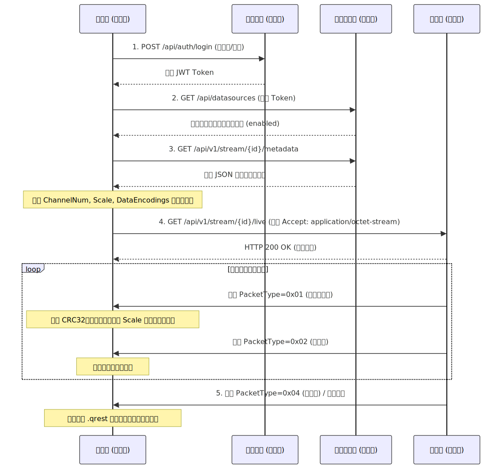

# qREST数据传输协议规范

**文档版本**: v1.0.1
**最后更新**: 2026-04-16

## 0.概述

qREST数据传输协议规范是一种专门为建筑结构轻量化地震监测（Light-weight S<sup>2</sup>HM）设计的数据交互协议。本协议作为《qREST文件存储格式规范》的配套网络层传输标准，旨在为传感器节点、监测平台与终端科研用户之间提供一个统一、标准化的实时数据分发框架。

本协议的核心设计理念为 “流储同构” (Stream-Storage Isomorphism)：即网络层传输的二进制数据包结构与本地落盘存储的数据包结构保持相同。这种设计消除了传统协议中网络包到存储包的转换损耗，使得接收端在完成基础的安全校验后，能够以零拷贝（Zero-copy）的方式将数据流直接追加写入 .qrest 数据文件中。

为了满足元数据的高可扩展性和传感数据的低延迟需求，本协议采用双模式通信架构：

- 控制面 (Control Plane)：基于 RESTful API 和 JSON 格式，负责认证、权限校验以及至关重要的**元数据（Metadata）**下发。
- 数据面 (Data Plane)：基于 HTTP 长连接的二进制流（Binary Stream），专门负责高频时序数据和流控状态的低延迟推送。

## 1.基本约定

### 1.1 名词解释

- **控制面** (Control Plane)：本协议中用于传输配置信息、状态信息和元数据的逻辑通道，采用标准 HTTP/HTTPS 请求。
- **数据面** (Data Plane)：本协议中用于连续传输传感器时序数据的逻辑通道，采用 application/octet-stream 二进制流。
- **元数据同步** (Metadata Synchronization)：在建立数据面连接前，接收端必须先通过控制面获取结构和通道的参数，以便正确解析后续的二进制数据。

### 1.2 通信与编码约定

- **端序约定**：所有二进制网络数据包中的多字节字段，均严格采用小端序 (Little Endian) 编码进行网络字节传输。
- **字符编码**：控制面交互的 JSON 文本数据统一采用 UTF-8 编码。
- **安全认证**：本协议在 HTTP 头部采用基于 Bearer Token 的 JWT 身份认证机制。所有的控制面和数据面请求均须在 Request Header 中携带`Authorization: Bearer <Token>`。

## 2. 数据交互流程

为了保证客户端（数据接收端）能够安全、正确地还原监测数据的物理量单位和关联的建筑结构属性，客户端在进行实时数据订阅时，必须严格遵循以下五个阶段的交互生命周期。任何越级的请求（例如未获取元数据直接请求数据流）都应被视为非法操作并被服务端拒绝。数据交互流程如下图所示：



### 2.1 阶段一：认证与授权 (Authentication)

本协议采用 JWT（JSON Web Token）进行严格的身份认证与访问控制。

#### 2.1.1 提交登录凭证

客户端首先需要通过`POST /api/auth/login`接口提交凭证：

```http
POST /api/auth/login

{
  "username": "admin",
  "password": "admin123"
}
```

#### 2.1.2 获取 JWT Token

成功后，获取到一个具有时效性的 JWT Token：

```json
{
  "token": "eyJhbGciOiJIUzI1NiIsInR5cCI6IkpXVCJ9...",
  "user": {
    "id": 1,
    "username": "admin",
    "name": "管理员",
    "role": "admin"
  }
}
```

在后续所有控制面（REST API）和数据面（Stream）的请求交互中，客户端必须在 HTTP 请求头中附加该凭证：`Authorization: Bearer <Token>`。

### 2.2 阶段二：寻址与状态检查 (Addressing)

客户端不应盲目向未知端点发起数据订阅，需要先查询有效数据源并检查其状态。

#### 2.2.1 数据源查询

客户端需要通过`/api/datasources`接口查询当前账户有权限访问的建筑结构监测数据源列表：

```http
GET /api/datasources?current=1&page_size=10&status=enabled
Authorization: Bearer {token}
```

- **路径参数**：
  - `current`：可选，当前页码，默认为1。
  - `page_size`：可选，每页数据条数，默认为10。
  - `status`：可选，数据源状态过滤，默认为 enabled（启用）。

#### 2.2.2 数据源状态检查

客户端必须检查目标数据源的`status`字段。只有处于`enabled`（启用）状态的数据源才能建立数据流连接。请求`disabled`（禁用）状态的数据源将被服务端拒绝。响应示例：

```
{
  "data": [
    {
      "id": 1,
      "name": "测试数据源",
      "description": "测试数据源描述",
      "type_": "file",
      "status": "enabled",
      "created_at": "2026-04-01T12:00:00Z",
      "updated_at": "2026-04-01T12:00:00Z"
    }
  ],
  "total": 1,
  "current": 1,
  "page_size": 10
}
```

响应中各字段说明：

| 字段 | 类型 | 说明 |
| ---- | ---- | ---- |
| data | `array` | 数据源列表 |
| data[].id | `integer` | 数据源ID |
| data[].name | `string` | 数据源名称 |
| data[].description | `string` | 数据源描述 |
| data[].type_ | `string` | 数据源类型 |
| data[].status | `string` | 数据源状态 |
| data[].created_at | `string` | 创建时间 |
| data[].updated_at | `string` | 更新时间 |
| total | `integer` | 数据源总数 |
| current | `integer` | 当前页码 |
| page_size | `integer` | 每页数据条数 |

### 2.3 阶段三：获取数据源并解析元数据 (Metadata Fetching)

在接入纯二进制流之前，客户端必须先通过控制面接口获取目标数据源的完整元数据，以便正确解析后续的数据包内容。

#### 2.3.1 获取元数据

客户端通过以下接口获取元数据：

```http
GET /api/datasources/{id}
Authorization: Bearer {token}
```

- **路径参数**：
  - `{id}`：必选，目标数据源的唯一标识符。

#### 2.3.2 解析元数据

响应示例：

```json
{
  "id": 1,
  "name": "测试数据源",
  "description": "测试数据源描述",
  "type_": "file",
  "status": "enabled",
  "config": {
    "file_path": "/data/test.qrest",
    "sampling_rate": 100,
    "loop": true
  },
  "Metadata": {...},
  "created_at": "2026-04-01T12:00:00Z",
  "updated_at": "2026-04-01T12:00:00Z"
}
```

其中 `Metadata` 字段包含了数据包解析所需的核心参数，具体定义参考《qREST文件存储格式规范》中元数据部分的字段说明。客户端必须正确解析这些参数，以确保后续接收的二进制数据包能够被正确还原为物理量并落盘存储。其他字段定义同[数据源查询接口](#222-数据源状态检查)中的字段说明。

### 2.4 阶段四：长连接建立与数据消费 (Stream Consumption)

准备工作就绪后，客户端向数据面发起长连接请求，正式订阅实时二进制数据流。

#### 2.4.1 建立数据流连接

客户端通过`/api/data-service/stream`接口发起请求，必须在请求头中声明接收二进制流。

```http
GET /api/data-service/stream?datasource_id=1
Authorization: Bearer {token}
Accept: application/octet-stream
```

- **路径参数**：
  - `datasource_id`：必选，目标数据源ID。

#### 2.4.2 数据流读取与解析

数据流中的每一个包严格遵循 32字节固定包头 + N字节数据体的结构。客户端必须按照以下步骤循环处理网络缓冲区中的字节流：

1. 读取包头：精确读取流中的前 32 个字节。
2. 合法性校验：解析前 2 个字节，校验 `Magic` 是否为 `0x7144`。若不匹配，说明数据流错位或损坏，应立即断开连接。
3. 识别数据包类型：解析第 5 字节的 `PacketType` 字段，判断当前包是正常数据包、心跳包还是异常状态包，并根据类型执行相应的处理逻辑。数据包类型定义详见[3.1.1](#311-数据包类型定义)。
4. 提取包体长度：解析包头第 24-27 字节的 `BodySize` 字段（数据体长度）。
5. 读取包体：从网络流中继续精确读取 `BodySize` 字节，作为当前的数据包体。
6. 数据完整性校验：使用 CRC32 算法计算读取到的包体校验和，并与包头第 28-31 字节的 `Checksum` 字段进行比对。一致则数据完整，否则丢弃该包。

### 2.5 阶段五：连接终止与资源释放 (Termination)

数据交互的结束分为两种情况：

- 服务端主动结束：服务端发送`PacketType=0x04`（结束包）或`PacketType=0x03`（异常状态包），通知客户端流已达终点或不可恢复。
- 客户端主动结束：客户端业务停止，直接断开 TCP 连接。

无论哪种情况，接收端客户端在断开连接前，都必须确保缓冲区中最后接收的完整数据已落盘，并安全关闭本地的 .qrest 文件句柄，防止数据文件损坏。

## 3.数据包格式说明

数据包采用二进制编码，分为包头和包体两部分。包头包含时序数据的采集时间和采样参数，包体包含各个通道的时序数据，按照预定义的顺序进行存储，以便程序能够正确读取和处理。相比于文件存储格式，网络传输协议中的数据包结构保持完全一致，以实现流储同构的设计理念。

### 3.1 包头字段说明

包头固定为 **32 字节**，采用 **小端序** (Little Endian) ,内存布局如下图：


各字段详细说明如下表所示：

| 偏移 | 字段名称 | 数据类型 | 长度 | 描述 |
| --- | --- | --- | --- | --- |
| 0 | Magic | `uint8[2]` | 2 字节 | 包头标识，固定为 `0x7144` (`"qD"`) |
| 2 | SourceID | `uint16` | 2 字节 | 数据源 ID |
| 4 | Version | `uint8` | 1 字节 | 协议版本号，当前为 `0x01` |
| 5 | PacketType | `uint8` | 1 字节 | 数据包类型，见[3.1.1](#311-数据包类型定义) |
| 6 | ChannelCount | `uint16` | 2 字节 | 通道数量 |
| 8 | DataEncodings | `uint16` | 2 字节 | 数据编码方式，见[3.1.2](#312-包体编码方式定义) |
| 10 | SamplingRate | `uint16` | 2 字节 | 采样率 (Hz) |
| 12 | DataPointCount | `uint32` | 4 字节 | 每个通道的数据点数量 |
| 16 | Timestamp | `uint64` | 8 字节 | 时间戳（毫秒） |
| 24 | BodySize | `uint32` | 4 字节 | 数据包长度（字节） |
| 28 | Checksum | `uint32` | 4 字节 | 数据包 CRC32 校验和，见[3.1.3](#313-数据校验) |

- **备注**：

BodySize 字段指示了紧随包头之后的数据包部分的字节长度，接收端可以根据该字段值正确读取数据包内容。其计算方式为：

其中 TypeSize 由 DataEncodings 字段指定。

结构体定义 (C 语言风格):

```c
typedef struct {
    uint8_t magic[2];          // 0x7144 ("qD")
    uint16_t source_id;      // 数据源ID
    uint8_t  version;         // 协议版本 0x01
    uint8_t  packet_type;     // 数据包类型
    uint16_t channel_count;   // 通道数量
    uint16_t data_encodings; // 数据编码方式
    uint16_t sampling_rate;   // 采样率(Hz)
    uint32_t data_point_count;// 每个通道的数据点数量
    uint64_t timestamp;       // 时间戳（毫秒）
    uint32_t body_size;       // 数据包包体长度
    uint32_t checksum;        // CRC32校验和
} QRestPacketHeader;
```

#### 3.1.1 数据包类型定义

PacketType 字段声明了当前数据包的类型，以便接收端能够根据类型执行不同的处理逻辑。定义如下：

| PacketType值 | 类型名称 | 说明 |
| ------------ | -------- | ---- |
| 0x01 | 正常数据包 | 包含实际监测数据 |
| 0x02 | 心跳包 | 如没有数据，发送空包，保持连接活跃 |
| 0x03 | 错误/状态包 | 服务器错误，无法继续提供数据服务 |
| 0x04 | 结束包 | 数据流结束、停用数据源 |

#### 3.1.2 包体编码方式定义

DataEncodings 字段定义了包体中时序数据的编码方式，以确保发送端和接收端能够正确解析和处理数据。定义如下：

| DataEncodings | 编码方式 | 说明 |
| ------------- | -------- | ---- |
| 0 | 32-bit 浮点数 (Float32) | 每个数据点使用 4 字节表示，适用于大多数监测数据 |
| 1 | 64-bit 浮点数 (Float64) | 每个数据点使用 8 字节表示，适用于需要高精度的场景 |
| 10 | 16-bit 整数 (Int16) | 每个数据点使用 2 字节表示，适用于资源受限的场景 |
| 11 | 32-bit 整数 (Int32) | 每个数据点使用 4 字节表示，适用于需要较高精度但又受限于存储空间的场景 |

#### 3.1.3 数据校验

Checksum 字段使用 CRC32 算法计算包体部分的校验和，以确保数据在传输过程中未被篡改或损坏。采集设备生成数据包应计算包体的 CRC32 校验和，并将结果存储在 Checksum 字段中。数据处理程序在读取数据包后，首先根据 BodySize 字段读取数据包内容，然后使用相同的 CRC32 算法计算读取到的包体的校验和，并与包头中的 Checksum 字段进行比较。如果两者匹配，则说明数据包完整，可以安全使用；如果不匹配，则说明数据包可能在传输过程中发生了错误或被篡改，应丢弃该数据包并查找错误。

**CRC32 算法参数：**
| 参数 | 值 |
| ---------- | ---------- |
| Polynomial | `0x04C11DB7` |
| Init | `0xFFFFFFFF` |
| RefIn | `False` |
| RefOut | `False` |
| XorOut | `0xFFFFFFFF` |

算法代码示例：

```c
uint32_t crc32(const uint8_t *data, size_t length) {
    uint32_t crc = 0xFFFFFFFF; 

    for (size_t i = 0; i < length; i++) {
        crc ^= data[i];

        for (int j = 0; j < 8; j++) {
            if (crc & 1) {
                crc = (crc >> 1) ^ 0xEDB88320;
            } else {
                crc >>= 1;
            }
        }
    }

    return ~crc;
}
```

### 3.2 包体数据格式说明

数据包包体包含了每个通道的时序数据，按照预定义的顺序进行存储。时序数据点数量由包头中的 DataPointCount 字段指定，数据编码方式由 DataEncodings 字段指定。读取时需要根据这些信息解析和处理包体中的时序数据，以确保数据的正确使用和分析。包体的具体结构如下图所示：


## 4.数据源管理

除了基本的获取数据源列表接口外，客户端还可以通过特定接口和请求管理数据源，实现数据源的创建、更新和删除等操作。本节将详细说明数据请求相关的接口定义和响应结果。

### 4.1 认证接口

#### 4.1.1 用户登录

- **请求**：

```http
POST /api/auth/login
{
  "username": "admin",
  "password": "admin123"
}
```

- **响应**：
```json
{
  "token": "eyJhbGciOiJIUzI1NiIsInR5cCI6IkpXVCJ9...",
  "user": {
    "id": 1,
    "username": "admin",
    "name": "管理员",
    "role": "admin"
  }
}
```

- **错误响应**：
  - 1001：用户名或密码错误。

#### 4.1.2 获取当前用户信息

- **请求**:

```http
GET /api/auth/me
Authorization: Bearer {token}
```

- **响应**:

```json
{
  "id": 1,
  "username": "admin",
  "name": "管理员",
  "role": "admin",
  "status": "active",
  "created_at": "2026-04-01T12:00:00Z"
}
```

- **错误响应**:
  - 1002：Token已过期。
  - 1003：Token无效。

### 4.2 数据源管理接口

#### 4.2.1 获取数据源列表

- **端点**：`GET /api/datasources`

- **路径参数**：

| 参数名 | 类型 | 必需 | 位置 | 说明 | 示例 |
| ------ | ---- | ---- | ---- | ---- | ---- |
| current | `integer` | 否 | query | 当前页码，从1开始 | `1` |
| page_size | `integer` | 否 | query | 每页数量，默认10 | `10` |
| status | `string` | 否 | query | 筛选状态：enabled/disabled | `enabled` |

- **请求示例**：

```http
GET /api/datasources?current=1&page_size=10&status=enabled
Authorization: Bearer {token}
```

- **返回参数**：

| 字段 | 类型 | 说明 |
| ---- | ---- | ---- |
| data | `array` | 数据源列表 |
| data[].id | `integer` | 数据源ID |
| data[].name | `string` | 数据源名称 |
| data[].description | `string` | 数据源描述 |
| data[].type_ | `string` | 数据源类型 |
| data[].status | `string` | 数据源状态 |
| data[].created_at | `string` | 创建时间 |
| data[].updated_at | `string` | 更新时间 |
| total | `integer` | 数据源总数 |
| current | `integer` | 当前页码 |
| page_size | `integer` | 每页数据条数 |

- **响应示例**：

```json
{
  "data": [
    {
      "id": 1,
      "name": "测试数据源",
      "description": "测试数据源描述",
      "type_": "file",
      "status": "enabled",
      "created_at": "2026-04-01T12:00:00Z",
      "updated_at": "2026-04-01T12:00:00Z"
    }
  ],
  "total": 1,
  "current": 1,
  "page_size": 10
}
```

- **错误响应**：
  - 1002：Token已过期。
  - 1003：Token无效。
  - 1004：没有权限访问数据源。

#### 4.2.2 创建数据源

- **端点**：`POST /api/datasources`

- **请求参数**：

| 参数名 | 类型 | 必需 | 位置 | 说明 | 示例 |
| ------ | ---- | ---- | ---- | ---- | ---- |
| name | `string` | 是 | body | 数据源名称 | `"测试数据源"` |
| description | `string` | 否 | body | 数据源描述 | `"测试数据源描述"` |
| type_ | `string` | 是 | body | 数据源类型 | `"file"` |
| config | `object` | 否 | body | 数据源配置项，具体字段根据type不同而不同 | `{...}` |
| status | `string` | 否 | body | 状态：enabled/disabled | `"enabled"` |
| Metadata | `object` | 否 | body | 元数据，包含解析数据包所需的参数 | `{...}` |

- **config参数说明**：

| 参数名 | 类型 | 必需 | 说明 |
| ------ | ---- | ---- | ---- |
| file_path | `string` | `type=file`时必需 | 数据文件路径 |
| sampling_rate | `integer` | `type=file`时必需 | 采样率(Hz) |
| loop | `boolean` | 否 | 是否循环播放，默认false |
| address | `string` | `type=seedlink/jopens`时必需 | 服务器地址 |
| port | `integer` | `type=seedlink/jopens`时必需 | 服务器端口 |

- **请求示例**：

```http
POST /api/datasources
Authorization: Bearer {token}

{
  "name": "测试数据源",
  "description": "测试数据源描述",
  "type_": "file",
  "config": {
    "file_path": "/data/test.qrest",
    "sampling_rate": 100,
    "loop": true
  },
  "status": "enabled",
  "Metadata": {...}
}
```

- **返回参数**：

| 字段 | 类型 | 说明 |
| ---- | ---- | ---- |
| id | `integer` | 数据源ID |
| name | `string` | 数据源名称 |
| description | `string` | 数据源描述 |
| type_ | `string` | 数据源类型 |
| status | `string` | 数据源状态 |
| config | `object` | 数据源配置参数 |
| Metadata | `object` | 数据源元数据 |
| created_at | `string` | 创建时间 |
| updated_at | `string` | 更新时间 |

- **响应示例**：

```json
{
  "id": 1,
  "name": "测试数据源",
  "description": "测试数据源描述",
  "type_": "file",
  "status": "enabled",
  "config": {
      "file_path": "/data/test.qrest",
      "sampling_rate": 100,
      "loop": true
  },
  "Metadata": {...},
  "created_at": "2026-04-01T12:00:00Z",
  "updated_at": "2026-04-01T12:00:00Z"
}
```

- **错误响应**：
  - 1002：Token已过期。
  - 1003：Token无效。
  - 1004：没有权限访问数据源。
  - 2001：参数缺失。
  - 2002：参数格式错误。
  - 2003：数据值错误。

#### 4.2.3 获取单个数据源

- **端点**：`GET /api/datasources/{id}`

- **路径参数**：
  - `{id}`：必选，数据源ID。

- **请求示例**：

```http
GET /api/datasources/1
Authorization: Bearer {token}
```

- **返回参数**：同[创建数据源接口](#422-创建数据源)的返回参数。

- **响应示例**：同[创建数据源接口](#422-创建数据源)的响应示例。

- **错误响应**：
  - 1002：Token已过期。
  - 1003：Token无效。
  - 1004：没有权限访问数据源。
  - 3001：数据源不存在。

#### 4.2.4 更新数据源

- **端点**：`PUT /api/datasources/{id}`

- **路径参数**：
  - `{id}`：必选，数据源ID。

- **请求参数**：

| 参数名 | 类型 | 必需 | 说明 | 约束 |
| ----------- | ------ | -- | ----- | ------------ |
| name | `string` | 否 | 数据源名称 | 长度1-100字符 |
| description | `string` | 否 | 数据源描述 | 最大500字符 |
| config | `object` | 否 | 数据源配置 | 根据type不同而不同 |
| Metadata | `object` | 否 | 元数据信息 | 详见Metadata定义 |

**请求示例**：

```http
PUT /api/datasources/1
Authorization: Bearer {token}

{
  "name": "更新后的数据源名称",
  "description": "更新后的描述",
  "config": {
    "file_path": "/data/updated.qrest",
    "sampling_rate": 200,
    "loop": false
  },
  "Metadata": {...}
}
```

**返回参数**：同[创建数据源接口](#422-创建数据源)的返回参数。

**响应示例**：同[创建数据源接口](#422-创建数据源)的响应示例。

- **错误响应**：
  - 1002：Token已过期。
  - 1003：Token无效。
  - 1004：没有权限访问数据源。
  - 2001：参数缺失。
  - 2002：参数格式错误。
  - 2003：数据值错误。
  - 3001：数据源不存在。

#### 4.2.5 删除数据源

- **端点**：`DELETE /api/datasources/{id}`
  
- **路径参数**：
  - `{id}`：必选，数据源ID。

- **请求示例**：

```http
DELETE /api/datasources/1
Authorization: Bearer {token}
```

- **返回参数**：无内容。

- **响应示例**:

```http
HTTP/1.1 204 No Content
```

- **错误响应**：
  - 1002：Token已过期。
  - 1003：Token无效。
  - 1004：没有权限访问数据源。
  - 3001：数据源不存在。
  - 3002：数据源无法删除（例如正在被使用）。

#### 4.2.6 启用/禁用数据源

- **端点**：`POST /api/datasources/{id}/{status}`

- **路径参数**：
  - `{id}`：必选，数据源ID。
  - `{status}`：必选，目标状态：enabled/disabled。

- **请求示例**：

```http
POST /api/datasources/1/enabled
Authorization: Bearer {token}
```

- **返回参数**：

| 字段 | 类型 | 说明 |
| ---- | ---- | ---- |
| success | `boolean` | 操作是否成功 |
| id | `integer` | 数据源唯一标识 |
| status | `string` | 更新后的状态，值为`"disabled"`或`"enabled"` |

- **响应示例**：

```json
{
  "success": true,
  "id": 1,
  "status": "enabled"
}
```

- **错误响应**：
  - 1002：Token已过期。
  - 1003：Token无效。
  - 1004：没有权限访问数据源。
  - 3001：数据源不存在。
  - 3003：数据源状态无法更新（例如正在被使用）。
  - 3004：无效的状态值（数据源已经处于目标状态）。

### 4.3 数据流接口

#### 4.3.1 建立数据流连接

- **端点**：`GET /api/data-service/stream`

- **路径参数**：
  - `datasource_id`：必选，目标数据源ID。

- **请求示例**：

```http
GET /api/data-service/stream?datasource_id=1
Authorization: Bearer {token}
Accept: application/octet-stream
```

- **返回参数**：二进制数据流，每个数据包包含32字节包头 + N字节数据体，具体格式详见[3.2 包体数据格式说明](#32-包体数据格式说明)。

- **错误响应**：
  - 1002：Token已过期。
  - 1003：Token无效。
  - 1004：没有权限访问数据源。
  - 3001：数据源不存在。
  - 3005：数据源不可用（例如未启用或正在维护）。

### 4.4 错误代码定义

#### 4.4.1 错误码分类

| 错误码范围 | 分类 | 说明 |
| --------- | ---- | ------------ |
| 1000-1999 | 认证错误 | Token相关、权限相关 |
| 2000-2999 | 参数错误 | 参数缺失、格式错误 |
| 3000-3999 | 资源错误 | 资源不存在、已删除 |
| 4000-4999 | 业务错误 | 数据源错误、数据处理错误 |
| 5000-5999 | 系统错误 | 服务器内部错误 |

#### 4.4.2 常见错误码列表

| 错误码 | 说明 | 可能原因 | 解决方案 |
| ---- | ------ | -------- | -------- |
| 1001 | 用户名或密码错误 | 提交的登录凭证不正确 | 检查用户名和密码是否正确 |
| 1002 | Token已过期 | JWT Token 已过期 | 重新登录获取新的 Token |
| 1003 | Token无效 | 提交的 Token 无效或格式错误 | 确保 Token 正确传递并且格式正确 |
| 1004 | 没有权限访问数据源 | 当前用户没有访问目标数据源的权限 | 联系管理员分配权限或检查用户角色设置 |
| 2001 | 参数缺失 | 请求中缺少必需的参数 | 检查请求参数是否完整 |
| 2002 | 参数格式错误 | 请求参数格式不正确 | 检查参数类型和格式是否符合要求 |
| 2003 | 数据值错误 | 请求参数值不合法 | 检查参数值是否在允许范围内 |
| 3001 | 数据源不存在 | 请求的数据源ID不存在 | 确认数据源ID是否正确或数据源是否已被删除 |
| 3002 | 数据源无法删除 | 数据源正在被使用，无法删除 | 确保数据源不再被使用后再尝试删除 |
| 3003 | 数据源状态无法更新 | 数据源正在被使用，无法更新状态 | 确保数据源不再被使用后再尝试更新状态 |
| 3004 | 无效的状态值 | 提交的状态值无效或数据源已经处于目标状态 | 检查状态值是否正确并且数据源当前状态是否已经是目标状态 |
| 3005 | 数据源不可用 | 数据源未启用或正在维护中 | 确认数据源状态并等待数据源可用后再尝试连接 |
| 4001 | 数据包格式错误 | 接收到的数据包格式不符合协议规范 | 检查数据包结构和字段是否正确 |
| 4002 | 数据包校验失败 | 接收到的数据包校验和不匹配 | 确保数据包在传输过程中未被篡改或损坏 |
| 4003 | 数据包类型错误 | 接收到的数据包类型未知或不支持 | 检查数据包类型字段是否正确并且符合协议定义 |
| 5001 | 服务器内部错误 | 服务器发生未预料的错误 | 联系管理员检查服务器日志以获取更多信息 |

## 5.数据流落盘规范

本节专门规范客户端在接收实时网络数据流时，如何正确地将其转化为符合《qREST文件存储格式规范》的本地 .qrest 文件。虽然本协议秉持“流储同构”的原则，但由于网络流包含用于保活的控制帧，且流的整体长度在接收前是未知的，客户端必须严格按照以下三个步骤进行文件读写操作。

### 5.1 步骤一：文件创建与初始化写入

客户端在完成[阶段三：获取并解析元数据](#23-阶段三获取数据源并解析元数据-metadata-fetching)后，发起长连接之前，必须先在本地创建并初始化 .qrest 文件。具体操作步骤如下：

1. 准备元数据：将获取到的元数据对象（JSON 格式）序列化为 UTF-8 编码的字节流，并记录其字节长度（MetadataSize）。
2. 构建文件头：在文件开头依次写入固定的 16 字节文件头：
    - Magic (8字节)：写入固定值 `0x7152455354000000` (`"qREST\0\0\0"`)。
    - MetadataSize (4字节，小端序)：写入上一步计算出的元数据字节长度。
    - DataSize (4字节，小端序)：占位写入 0。由于此时尚未开始接收数据，数据包总长度未知，先以 0 占位。
3. 写入元数据：紧接在 16 字节文件头之后，写入 UTF-8 编码的 JSON 元数据字节流。
4. 初始化计数器：在内存中初始化一个数据包总长度计数器`total_data_bytes = 0`，用于记录后续成功追加的数据字节数。

### 5.2 步骤二：数据流的过滤与追加

在进入[阶段四：建立数据流连接](#431-建立数据流连接)后，客户端会源源不断地接收到 32 字节包头和变长包体。客户端必须对网络包进行严格的过滤，绝不能将纯网络控制帧写入文件。

处理逻辑如下：

1. 类型判断：读取并解析 32 字节包头后，检查 PacketType（偏移量 5）字段。
2. 正常数据落盘 (`PacketType == 0x01`)：
    - 只有`0x01`类型的包属于合法的业务数据。
    - 在完成 CRC32 校验后，客户端需将当前的 32 字节包头 + BodySize 字节的包体 完整且原封不动地追加写入到 .qrest 文件末尾。
    - 更新内存计数器：`total_data_bytes += (32 + BodySize)`。
3. 控制帧丢弃 (`PacketType == 0x02` 或 `PacketType == 0x03`)：
    - 心跳包（`0x02`）和异常状态包（`0x03`）仅用于维持网络状态和报警。
    - 客户端在解析这些包头并执行相应的网络逻辑（如重置超时器、报警）后，必须将这些数据包直接丢弃，严禁写入 .qrest 文件，以确保文件中包含的每一个数据包其 PacketType 均严格为`0x01`。

### 5.3 步骤三：文件收尾与指针回写

当接收到服务端下发的结束包（`PacketType == 0x04`），或客户端主动停止监测任务时，标志着当前文件的时序数据录入结束。为了保证文件的完整性和可解析性，客户端必须对步骤一中占位的 DataSize 进行回写更新。

1. 停止追加：停止向文件末尾追加任何新的数据包。
2. 指针回退 (Seek)：将本地文件操作指针（File Pointer）移动至文件开头偏移量为 12 字节 的位置（即文件头中 DataSize 字段的起始位置）。
3. 回写数据总长度：将内存中统计的`total_data_bytes`以`uint32`小端序格式覆盖写入该位置（占 4 字节）。
4. 安全关闭：执行文件流的 Flush（刷盘）操作，并安全关闭文件句柄（Close），此时一个标准且完整的 .qrest 文件即生成完毕。